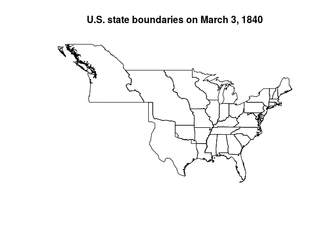
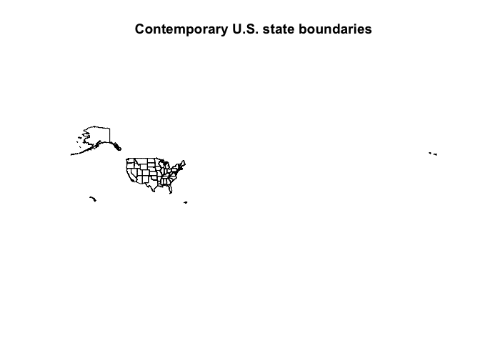
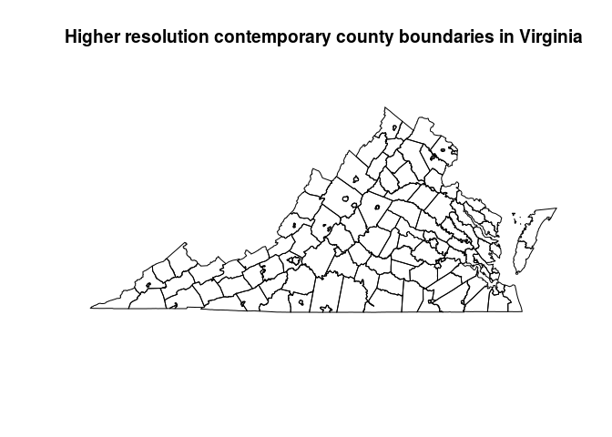
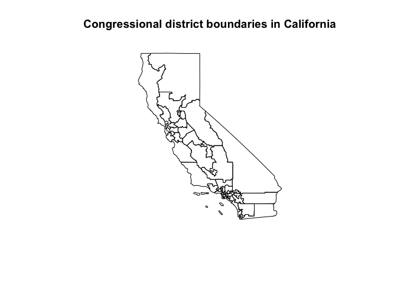

<!-- README.md is generated from README.Rmd. Please edit that file -->
USAboundaries: Historical and Contemporary Boundaries of the United States of America
-------------------------------------------------------------------------------------

[](http://cran.r-project.org/package=USAboundaries) [](https://travis-ci.org/ropensci/USAboundaries) [](https://ci.appveyor.com/project/ropensci/USAboundaries)

This R package includes contemporary state, county, congressional district, and zip code tabulation area boundaries for the United States of America, as well as historical boundaries from 1629 to 2000 for states and counties from the Newberry Library's [Atlas of Historical County Boundaries](http://publications.newberry.org/ahcbp/).

### Installation

You can install this package from CRAN.

    install.packages("USAboundaries")

Or you can install the development version from GitHub using [devtools](https://github.com/hadley/devtools). You will also have to install the data-only package.

    devtools::install_github("ropensci/USAboundariesData")
    devtools::install_github("ropensci/USAboundaries")

### Use

This package provides a set of functions, one for each of the types of boundaries that are available. These functions have a consistent interface.

Passing a date to `us_states()` or `us_counties()` returns the boundaries for that date. If no date argument is passed, then contemporary boundaries are returned. The functions `us_congressional()` and `us_zipcodes()` only offer contemporary boundaries.

For any function, pass a character vector of state names to the `states =` argument to return only those states or territories.

For certain functions, more or less detailed boundary information is available by passing an argument to the `resolution =` argument.

See the examples below to see how the interface works, and see the documentation for each function for more details.

``` r
library(USAboundaries) 
#> Loading required package: USAboundariesData
library(sp) # for the plot.SpatialPolygonsDataFrame method

states_1840 <- us_states("1840-03-12")
plot(states_1840)
title("U.S. state boundaries on March 3, 1840")
```



``` r

states_contemporary <- us_states()
plot(states_contemporary)
title("Contemporary U.S. state boundaries")
```



``` r

counties_va_1787 <- us_counties("1787-09-17", states = "Virginia")
plot(counties_va_1787)
title("County boundaries in Virginia in 1787")
```


``` r

counties_va <- us_counties(states = "Virginia")
plot(counties_va)
title("Contemporary county boundaries in Virginia")
```


``` r

counties_va_highres <- us_counties(states = "Virginia", resolution = "500k")
plot(counties_va_highres)
title("Higher resolution contemporary county boundaries in Virginia")
```



``` r

zips <- us_zipcodes(states = c("North Dakota", "South Dakota"))
plot(zips)
title("Zip code tabulation areas in North and South Dakota")
```


``` r

congress <- us_congressional(states = "California")
plot(congress)
title("Congressional district boundaries in California")
```



### Related packages

Each function returns a `SpatialPolygonsDataFrame` which is suitable for use with the [sp](http://cran.rstudio.org/web/packages/sp/) or [leaflet](http://cran.rstudio.org/web/packages/leaflet/) packages, and which can be fortified for use with [ggplot2](http://cran.rstudio.org/web/packages/ggplot2/). See the [geojsonio](http://cran.rstudio.org/web/packages/geojsonio/) package for functions to convert these boundaries to GeoJSON.

If you need U.S. Census Bureau boundary files which are not provided by this package, consider using the [tigris](https://github.com/walkerke/tigris) package, which downloads those shapefiles.

### Citation and license

The historical data provided in this package is available under the CC BY-NC-SA 2.5 license from John H. Long, et al., [Atlas of Historical County Boundaries](http://publications.newberry.org/ahcbp/), Dr. William M. Scholl Center for American History and Culture, The Newberry Library, Chicago (2010). Please cite that project if you use this package in your research and abide by the terms of their license if you use the historical information.

The contemporary data is provided by the [U.S. Census Bureau](https://www.census.gov/geo/maps-data/).

All code in this package is copyright [Lincoln Mullen](http://lincolnmullen.com) and is released under the MIT license.

If you use this package in your research, I would appreciate a citation.

``` r
citation("USAboundaries")
#> 
#> To cite package 'USAboundaries' in publications use:
#> 
#>   Lincoln Mullen (2015). USAboundaries: Historical and
#>   Contemporary Boundaries of the United States of America. R
#>   package version 0.2.0.9000.
#>   https://github.com/ropensci/USAboundaries
#> 
#> A BibTeX entry for LaTeX users is
#> 
#>   @Manual{,
#>     title = {USAboundaries: Historical and Contemporary Boundaries of the United States of America},
#>     author = {Lincoln Mullen},
#>     year = {2015},
#>     note = {R package version 0.2.0.9000},
#>     url = {https://github.com/ropensci/USAboundaries},
#>   }
```

------------------------------------------------------------------------

[](http://ropensci.org)
