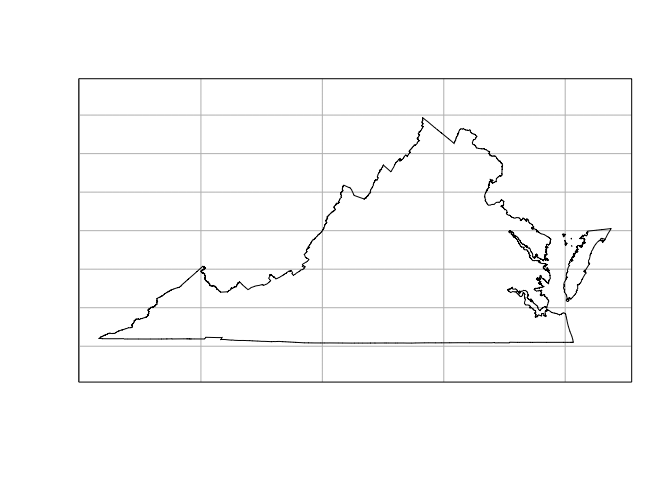
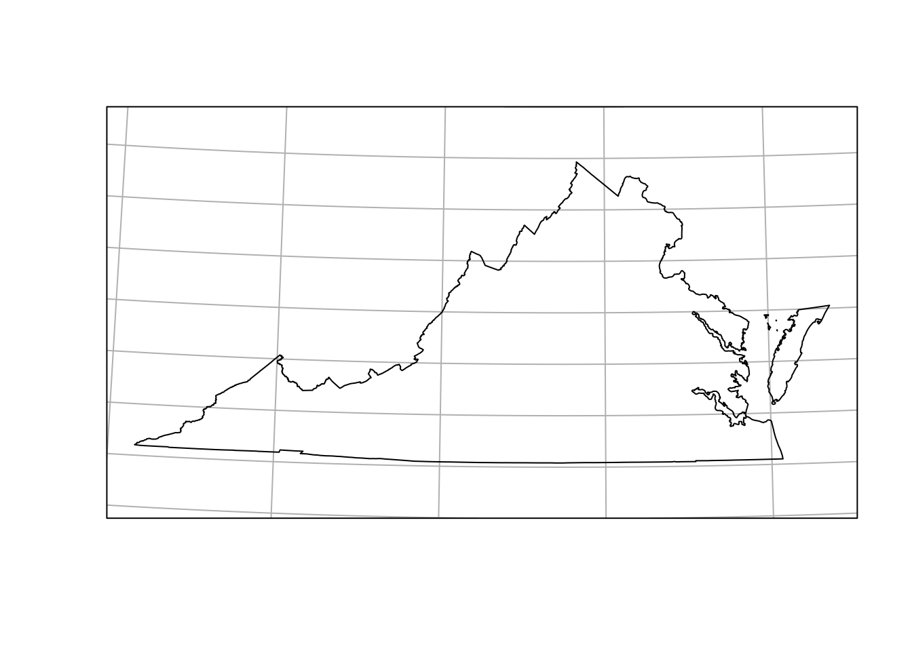
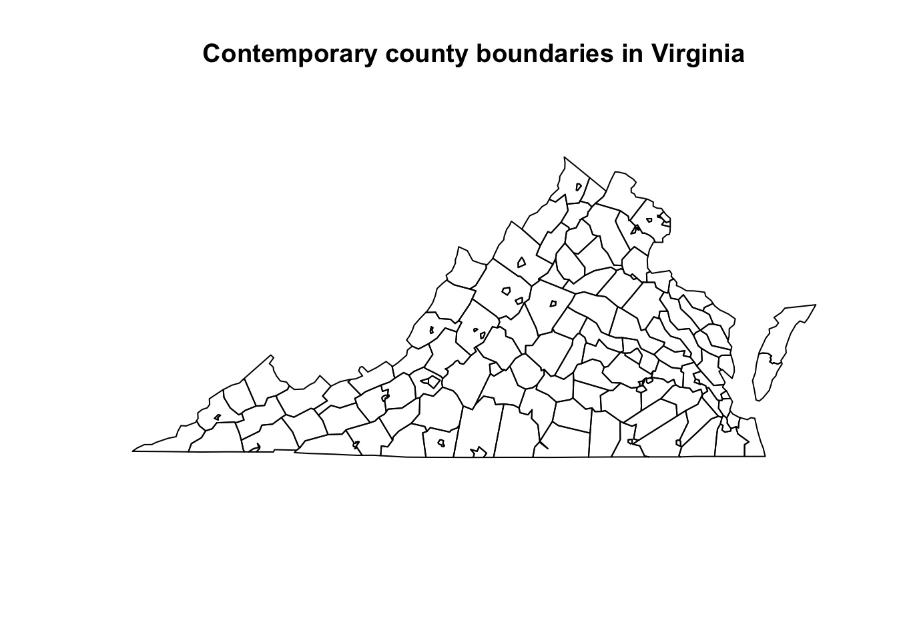
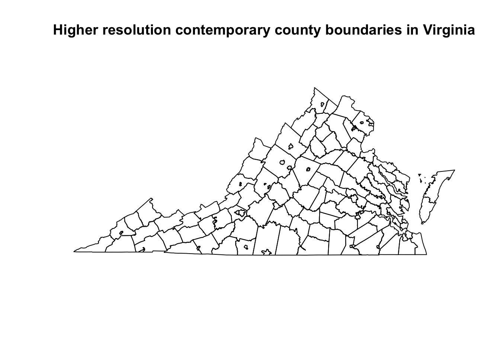
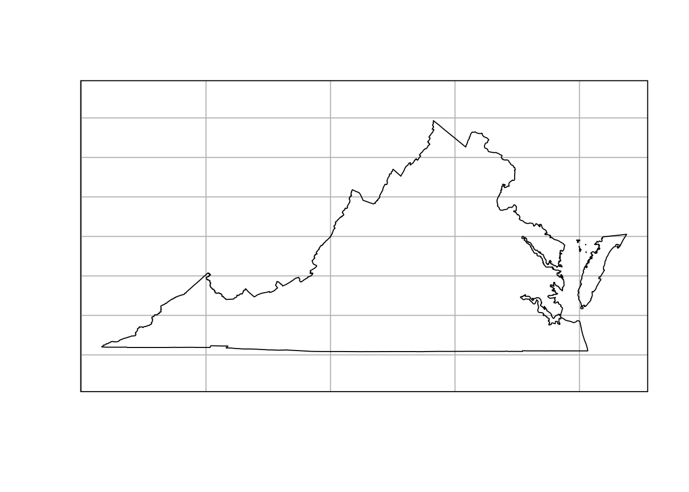
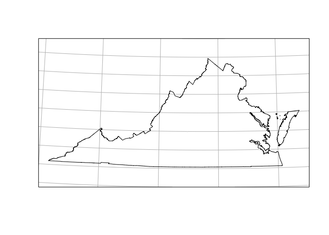

<!-- README.md is generated from README.Rmd. Please edit that file -->

# USAboundaries

[](http://cran.r-project.org/package=USAboundaries)
[](https://doi.org/10.21105/joss.00314)
[](https://github.com/ropensci/USAboundaries/actions)
[](https://travis-ci.org/ropensci/USAboundaries)
[](https://codecov.io/github/ropensci/USAboundaries?branch=master)

## Overview

This R package includes contemporary state, county, and Congressional
district boundaries, as well as zip code tabulation area centroids. It
also includes historical boundaries from 1629 to 2000 for states and
counties from the Newberry Library’s [Atlas of Historical County
Boundaries](http://publications.newberry.org/ahcbp/), as well as
historical city population data from Erik Steiner’s “[United States
Historical City Populations,
1790-2010](https://github.com/cestastanford/historical-us-city-populations).”
The package has some helper data, including a table of state names,
abbreviations, and FIPS codes, and functions and data to get [State
Plane Coordinate
System](https://en.wikipedia.org/wiki/State_Plane_Coordinate_System)
projections as EPSG codes or PROJ.4 strings.

This package can serve a number of purposes. The spatial data can be
joined to any other kind of data in order to make thematic maps. Unlike
other R packages, this package also contains historical data for use in
analyses of the recent or more distant past. See the [“A sample analysis
using
USAboundaries”](http://lincolnmullen.com/software/usaboundaries/articles/usaboundaries-sample-analysis.html)
vignette for an example of how the package can be used for both
historical and contemporary maps.

## Citation

If you use this package in your research, we would appreciate a
citation.

``` r
citation("USAboundaries")
#> 
#> To cite the USAboundaries package in publications, please cite the
#> paper in the Journal of Open Source Software:
#> 
#>   Lincoln A. Mullen and Jordan Bratt, "USAboundaries: Historical and
#>   Contemporary Boundaries of the United States of America," Journal of
#>   Open Source Software 3, no. 23 (2018): 314,
#>   https://doi.org/10.21105/joss.00314.
#> 
#> A BibTeX entry for LaTeX users is
#> 
#>   @Article{,
#>     title = {{USAboundaries}: Historical and Contemporary Boundaries
#> of the United States of America},
#>     author = {Lincoln A. Mullen and Jordan Bratt},
#>     journal = {Journal of Open Source Software},
#>     year = {2018},
#>     volume = {3},
#>     issue = {23},
#>     pages = {314},
#>     url = {https://doi.org/10.21105/joss.00314},
#>     doi = {10.21105/joss.00314},
#>   }
```

## Installation

You can install this package from CRAN.

    install.packages("USAboundaries")

Almost all of the data for this package is provided by the
[USAboundariesData
package](https://github.com/ropensci/USAboundariesData). That package
will be automatically installed (with your permission) from the
[rOpenSci package repository](http://packages.ropensci.org/) the first
time that you need it.

Or you can install the development versions from GitHub using
[remotes](https://remotes.r-lib.org).

    # install.packages("remotes")
    remotes::install_github("ropensci/USAboundaries")
    remotes::install_github("ropensci/USAboundariesData")

## Use

This package provides a set of functions, one for each of the types of
boundaries that are available. These functions have a consistent
interface.

Passing a date to `us_states()`, `us_counties()`, and `us_cities()`
returns the historical boundaries for that date. If no date argument is
passed, then contemporary boundaries are returned. The functions
`us_congressional()` and `us_zipcodes()` only offer contemporary
boundaries.

For almost all functions, pass a character vector of state names or
abbreviations to the `states =` argument to return only those states or
territories.

For certain functions, more or less detailed boundary information is
available by passing an argument to the `resolution =` argument.

See the examples below to see how the interface works, and see the
documentation for each function for more details.

``` r
library(USAboundaries) 
library(sf) # for plotting and projection methods
#> Linking to GEOS 3.9.1, GDAL 3.3.2, PROJ 8.1.1

states_1840 <- us_states("1840-03-12")
#> old-style crs object detected; please recreate object with a recent sf::st_crs()
#> old-style crs object detected; please recreate object with a recent sf::st_crs()
plot(st_geometry(states_1840))
title("U.S. state boundaries on March 3, 1840")
```

<!-- -->

``` r
states_contemporary <- us_states()
plot(st_geometry(states_contemporary))
#> old-style crs object detected; please recreate object with a recent sf::st_crs()
#> old-style crs object detected; please recreate object with a recent sf::st_crs()
#> old-style crs object detected; please recreate object with a recent sf::st_crs()
title("Contemporary U.S. state boundaries")
```

<!-- -->

``` r
counties_va_1787 <- us_counties("1787-09-17", states = "Virginia")
#> old-style crs object detected; please recreate object with a recent sf::st_crs()
#> old-style crs object detected; please recreate object with a recent sf::st_crs()
plot(st_geometry(counties_va_1787))
title("County boundaries in Virginia in 1787")
```

<!-- -->

``` r
counties_va <- us_counties(states = "Virginia")
plot(st_geometry(counties_va))
title("Contemporary county boundaries in Virginia")
```

<!-- -->

``` r
counties_va_highres <- us_counties(states = "Virginia", resolution = "high")
plot(st_geometry(counties_va_highres))
title("Higher resolution contemporary county boundaries in Virginia")
```

<!-- -->

``` r
congress <- us_congressional(states = "California")
plot(st_geometry(congress))
title("Congressional district boundaries in California")
```

<!-- -->

## State plane projections

The `state_plane()` function returns EPSG codes and PROJ.4 strings for
the State Plane Coordinate System. You can use these to use suitable
projections for specific states.

``` r
va <- us_states(states = "VA", resolution = "high")
plot(st_geometry(va), graticule = TRUE)
```

<!-- -->

``` r
va_projection <- state_plane("VA")
va <- st_transform(va, va_projection)
plot(st_geometry(va), graticule = TRUE)
```

<!-- -->

## Related packages

Each function returns an `sf` object from the
[sf](http://cran.r-project.org/package=sf) package, which can be mapped
using the [leaflet](http://cran.r-project.org/package=leaflet) or
[ggplot2](http://cran.r-project.org/package=ggplot2) packages.

If you need U.S. Census Bureau boundary files which are not provided by
this package, consider using the
[tigris](http://cran.r-project.org/package=tigris) package, which
downloads those shapefiles.

## License

The historical boundary data provided in this package is available under
the CC BY-NC-SA 2.5 license from John H. Long, et al., [Atlas of
Historical County Boundaries](http://publications.newberry.org/ahcbp/),
Dr. William M. Scholl Center for American History and Culture, The
Newberry Library, Chicago (2010). Please cite that project if you use
this package in your research and abide by the terms of their license if
you use the historical information.

The historical population data for cities is provided by U.S. Census
Bureau and Erik Steiner, Spatial History Project, Center for Spatial and
Textual Analysis, Stanford University. See the data in [this
repository](https://github.com/cestastanford/historical-us-city-populations).

The contemporary data is provided by the [U.S. Census
Bureau](https://www.census.gov/geo/maps-data/) and is in the publication
domain.

All code in this package is copyright [Lincoln
Mullen](http://lincolnmullen.com) and is released under the MIT license.

------------------------------------------------------------------------

[](http://ropensci.org)
